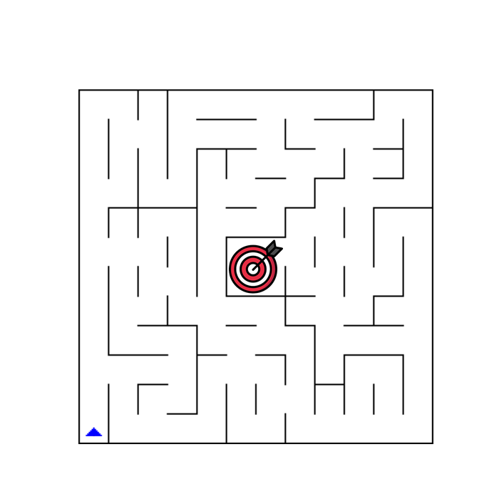
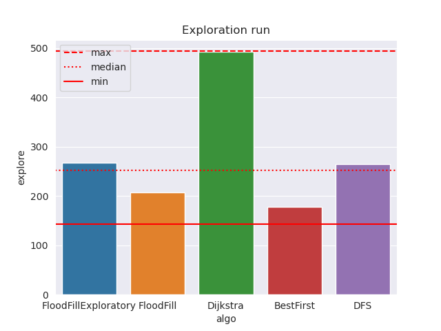
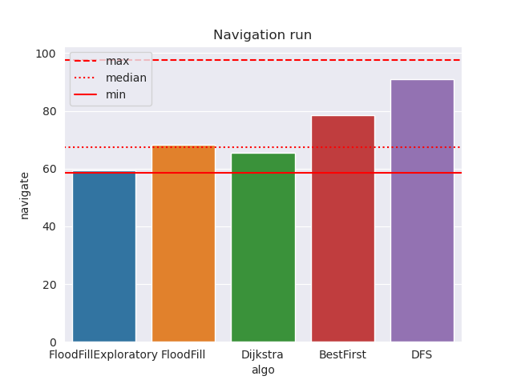
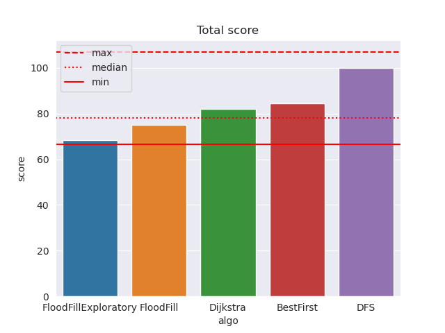
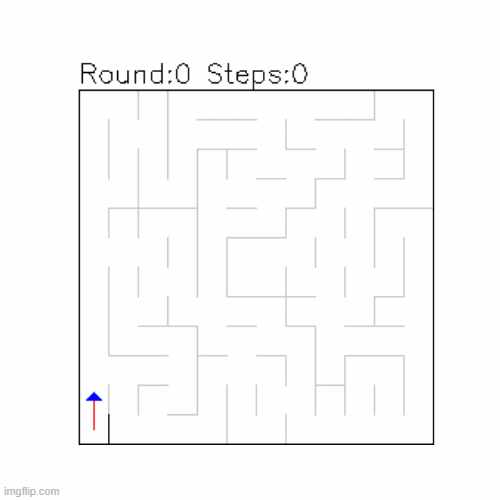

## INTRODUCTION

Path planning is the task of finding a path from a starting point to a goal point in a given environment. In the context of mobile robots, the path must also take into account the presence of obstacles. 

FloodFill Optimization (LFO)

- Flood Fill is a widely-used algorithm for filling an area with a color or value and extending the fill to adjacent areas.
- It operates by starting at a designated location and progressively exploring the neighboring area.
- Utilizes a recursive approach, recursively calling itself on adjacent locations until the entire area is filled.
- Flood Fill has a proven track record in Micromouse competitions.
- Particularly effective in solving Micromouse mazes due to its inherent characteristics
- Unlike other algorithms, Flood Fill didn't require any adjustments to function effectively in the project's context.
- Flood Fill's adaptability in dealing with unexplored maze environments made it an ideal choice.
- Flood Fill was selected based on its suitability, effectiveness, and adaptability to the project's requirements.
- This introduction sets the stage for understanding Flood Fill's role in the maze-solving project, highlighting its significance and advantages.
  

## OBJECTIVES

1. Efficient Pathfinding: The primary objective would likely be to develop an algorithm that can efficiently find the shortest path from a starting point to a target destination within a given maze or grid-based environment.
2. Optimized Resource Utilization: Another objective could be to optimize resource utilization, such as memory and processing power, by employing flood fill techniques. 
3. Robustness and Flexibility: The project might aim to create a pathfinding solution that is robust and adaptable to different maze configurations and obstacle layouts.

## RESULTS

The modified Flood Fill algorithm proved to be the most efficient and effective among the algorithms analyzed. Its superior speed and efficiency were evident in consistently achieving the lowest scores, attributed to a longer exploration run and optimized navigation phase. However, the Flood Fill algorithm, while strong in exploration, struggled slightly in navigation due to the limitation of a single exploration run. Dijkstra's algorithm performed reasonably well but exhibited a high exploration run, suggesting potential inefficiencies. 

BestFirst algorithm excelled in exploration but faced challenges in navigation due to its greedy nature. Conversely, the DFS algorithm consistently performed poorly due to its reliance on random exploration. Overall, while each algorithm had strengths and weaknesses, the modified Flood Fill algorithm emerged as the most effective in maze-solving tasks, showcasing its superiority in speed and efficiency.

Flood Fill Exploratory Result:

Flood Fill Result:

Dijkstra Algorithm Result:

Depth First Search Result:

Breadth First Search Result:

## CONCLUSION

Advantages:

1. Comprehensive Analysis: The project provides a detailed analysis of various maze-solving algorithms, including their performance in both exploration and navigation phases. This comprehensive approach allows for a deep understanding of each algorithm's strengths and weaknesses.
2. Creative Problem-Solving: The project demonstrates creative problem-solving skills by adapting existing algorithms to fit the constraints of the maze-solving scenario. Modifying algorithms like BestFirst and Dijkstra to suit the limitations of the robot's movement showcases adaptability and innovation.
3. Learning Opportunity: The project serves as a valuable learning experience for understanding maze-solving algorithms, implementing them, and analyzing their performance. It offers insights into algorithmic efficiency and trade-offs in real-world applications.
4. Identification of Improvement Areas: The project identifies specific areas for improvement in each algorithm, such as optimizing exploration strategies, refining implementation details, and enhancing robot movement capabilities. This insight is crucial for iterative refinement and enhancement of the algorithms.

Disadvantages:

1. Limited Exploration Runs: Restricting the algorithms to a single exploration run may hinder their ability to fully map the maze and find optimal paths, as seen with the Flood Fill algorithm. Allowing for multiple exploration runs could provide a more accurate representation of the maze and potentially improve algorithm performance.
2. Implementation Challenges: The project acknowledges potential implementation issues or compatibility issues with certain algorithms, such as Dijkstra's algorithm. These challenges may affect the reliability and consistency of algorithm performance, requiring thorough debugging and optimization efforts.
3. Algorithm Specific Limitations: Some algorithms, like Depth-First Search (DFS), may not be well-suited for the maze-solving task due to their uninformed nature. Relying on random exploration without considering specific maze characteristics can lead to suboptimal results. It's essential to recognize the limitations of each algorithm and select or modify them accordingly.

